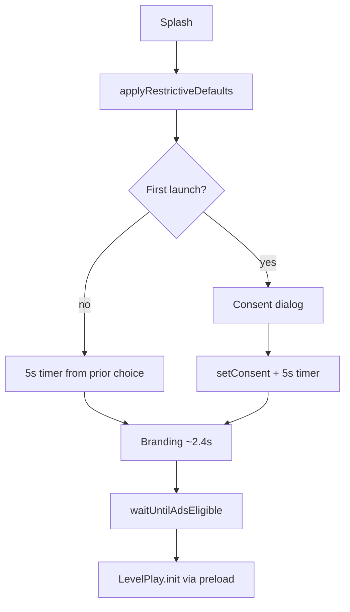

# Device test — Task 9 (consent + LevelPlay privacy)

**READY_FOR_DEVICE_TEST**

---

## Flow (cold start)



---

## Build

```bash
flutter run --dart-define=ADS_TEST_MODE=true
```

Clear app data for first-install scenario:

```bash
adb shell pm clear com.kakonzone.lumio
```

---

## First install

1. Cold start → **Ads & privacy** dialog before HOME.
2. Log order (no `[LevelPlay] init success` before consent choice):
   - `[AdConsent] showing first-launch dialog`
   - `[AdConsent] granted` or `[AdConsent] denied` — ads eligible in **5000ms**
   - `[AdConsent] splash ad gate open — preload may call LevelPlay.init`
   - `[LevelPlay] setDynamicUserId` → `[LevelPlay] init success` (if ads test mode on)
3. No interstitial **before** dialog dismiss.
4. Time from tap **Accept** / **Limited** to first LevelPlay init log ≥ **5s** (minus ~2.4s branding overlap — total splash ≥5s after choice).

**Must not appear before consent:**

`[LevelPlay] init success`  
(OK: `[LevelPlay] init blocked — consent not resolved` only if something calls init early)

---

## Returning user

1. Second launch → **no** dialog; log `[AdConsent] prior choice loaded (granted|denied)`.
2. Drawer → **Ads & privacy** → switch **Personalized** ↔ **Limited** → SnackBar.
3. Force-stop and relaunch → choice persisted.

---

## Privacy flags (LevelPlay 9.2.0)

| User choice | GDPR `LevelPlay` | CCPA |
|-------------|------------------|------|
| Not asked (splash defaults) | false | false |
| Personalized (granted) | true | false |
| Limited (denied) | false | true |

After change: `[AdConsent] LevelPlay privacy flags applied`

---

## Log grep

```bash
adb logcat -d | grep -E '\[AdConsent\]|\[LevelPlay\] init'
```

---

## Pass / fail criteria

| # | Criterion | Pass |
|---|-----------|------|
| 1 | Consent dialog before any interstitial / HOME ads | ☐ |
| 2 | ≥5s after consent before LevelPlay init (see logs) | ☐ |
| 3 | No `init success` before consent on first install | ☐ |
| 4 | Drawer privacy screen persists choice | ☐ |
| 5 | `flutter test test/ads/ad_consent_service_test.dart` | ☐ |

**Automated:**

```bash
flutter test test/ads/ad_consent_service_test.dart
```

**Task 9 result:** ☐ PASS ☐ FAIL — Tester: __________ Date: __________
