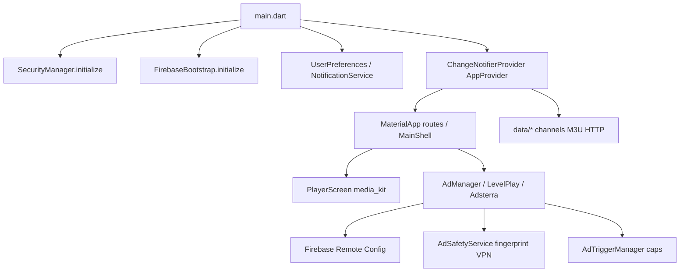

# Lumio Sports TV — Full Application Audit

**Audit type:** READ-ONLY (no code changes)  
**Repository:** `/home/kakonzone/Downloads/FlutterProject/lumio` (same as `/mnt/ssd3/Ubuntu/FlutterProject/lumio`)  
**Package:** `lumio_tv` 1.0.0+1 · Android `com.kakonzone.lumio`

---

### Section 0 — Audit Metadata

| Field | Value |
|-------|-------|
| Audit date | 2026-05-26 |
| Auditor role | Automated full-application review (read-only) |
| Flutter / Dart | 3.41.6 / 3.11.4 (`flutter --version`) |
| Git HEAD | `ea73252cede468176e01bfe29a60c2515e963e55` — message `first commit` (2026-05-23) |
| Branch | `main` (tracks `origin/main`) |
| Working tree | **Dirty** — 40+ modified paths, 50+ untracked (`git status -sb`) |
| `lib/` Dart files | 114 (`find lib -name "*.dart" \| wc -l`) |
| `lib/` LOC | 30,408 (`find lib -name "*.dart" \| xargs wc -l`) |
| Unit/widget tests | 30 `*_test.dart` under `test/` |
| In-repo docs | 66 `docs/*.md` (`find docs -name "*.md" \| wc -l`) |
| Prior audit artifacts | `docs/PRODUCTION_READINESS.md`, `docs/TASK_VERIFICATION.md`, `docs/DRIFT_REPORT.md`, `docs/DEVICE_TEST_RESULTS.md`, task verification docs — **no** prior `FULL_APPLICATION_AUDIT.md` |
| Device log evidence (user session) | LevelPlay **627** duplicate-load guard verified in code; **509** no-fill treated as dashboard/mediation issue; **AdsterraCache** miss/hit/TTL-expired patterns per `docs/TASK_VERIFICATION.md`; **no** reserved Firebase event-name errors in session |

**Commands executed (outputs summarized in later sections):**

```text
$ flutter --version
Flutter 3.41.6 • channel stable • https://github.com/flutter/flutter.git
Framework • revision db50e20168 (9 weeks ago) • 2026-03-25 16:21:00 -0700
Engine • hash 5cdd32777948fa7a648fac915f8da7120ac7e97a (revision 425cfb54d0) (1 months ago) • 2026-03-25 20:14:42.000Z
Tools • Dart 3.11.4 • DevTools 2.54.2

$ flutter analyze 2>&1 | tail -3
102 issues found. (ran in 13.9s)
# Breakdown: 0 errors, 25 warnings, 77 infos (grep -c on analyze output)

$ flutter test 2>&1 | tail -1
00:58 +95: All tests passed!

$ find lib -name "*.dart" | wc -l → 114
$ find lib -name "*.dart" | xargs wc -l | tail -1 → 30408 total
```

---

### Section 1 — Executive Summary (max 300 words)

Lumio Sports TV is a Flutter IPTV/sports streaming client with a **tri-network ad stack** (LevelPlay mediation, Adsterra WebView/direct links, no AdMob) (`pubspec.yaml:57-59`, `docs/ADS_README.md:5-9`). The codebase is **large and centralized**: two files exceed 3,000 lines (`player_screen.dart` 3,399; `app_provider.dart` 3,299) (`find … wc -l`). State uses **Provider** + **Navigator 1.0** (`lib/main.dart:64-107`).

**Static quality:** `flutter analyze` reports **0 errors**, **25 warnings**, **77 infos** (102 total). **95** unit/widget tests pass (`flutter test`). **No** GitHub Actions workflow (`.github/` absent). **No** Crashlytics/Sentry (`grep` on `pubspec.yaml` / `lib/` — no matches).

**Security / compliance concerns:** Hundreds of **HTTP** stream URLs in `lib/data/` plus a broad Android cleartext allowlist (`android/app/src/main/res/xml/network_security_config.xml:29+`). `lib/models/model.dart:10` still documents `YOUR_TOFFEE_COOKIE_HERE`, while `lib/provider/app_provider.dart:30-37` embeds a live JWT-style `subscriberToken` in source — credential leakage risk. Monetization keys are correctly moved to `--dart-define` (`lib/config/ad_config.dart:47-58`), but **plain `flutter run`** without `secrets.json` blocks ads (`docs/DEVICE_TEST_RESULTS.md:32-35`).

**Device/session evidence (per user):** LevelPlay duplicate load (**627**) mitigated by in-flight guard (`lib/services/ironsource_service.dart:274-276`); **509** no-fill attributed to mediation dashboard fill, with client backoff (`ironsource_service.dart:235-321`); Adsterra cache miss → hit → TTL expiry logging (`lib/ads/adsterra/adsterra_native_cache.dart:32-38`); Firebase reserved-name collisions avoided via `lumio_*` events (`lib/ads/analytics/ad_analytics.dart:20-47`).

**Verdict:** Feature-rich prototype with substantial ad/fraud hardening and test coverage, but **not store-ready** without resolving secrets in tree, legal/stream sourcing, CI, observability, accessibility, and documented release/device gates (`docs/PRODUCTION_READINESS.md:83-90`).

---

### Section 2 — Project Structure & Architecture

**Top-level layout (disk):**

| Path | Size | Role |
|------|------|------|
| `lib/` | 1.2M | Application Dart (`du -sh lib`) |
| `android/` | 55M | Primary ship target (native security, ads manifest) |
| `ios/` | 512K | Scaffold / launcher icons |
| `assets/` | 1.1M | Images, fonts (Barlow), `assets/data/` playlists |

**`lib/` module map (114 files):**

| Area | Path | Notes |
|------|------|-------|
| Entry / shell | `lib/main.dart`, `lib/core/` | `ChangeNotifierProvider` + `MaterialApp` routes (`main.dart:64-107`) |
| Screens | `lib/screens/` | TV hub, player, news, sports/live/categories, splash, ads privacy, dev diagnostics |
| State | `lib/provider/app_provider.dart` | Channels, favourites, M3U, Toffee fetches, scores — **3,299 LOC** |
| Ads | `lib/ads/`, `lib/config/ad_config.dart`, `lib/services/ad_*` | Manager, waterfall, Adsterra, LevelPlay service |
| Security / fraud | `lib/security/`, `lib/services/fraud/`, `lib/services/vpn_signal_service.dart` | Root/emulator/VPN/signature checks |
| Data | `lib/data/` | `extra_channels.dart`, `toffee_channels.dart`, `user_paste_channels.dart`, `mock_data.dart` |
| Network | `lib/network/secure_dio.dart`, `package:http` in services | Dual HTTP stacks |
| Server (orphan) | `lib/server/server.dart` | Shelf HTTP server with `main()` — **not** wired to mobile `main()` (`lib/server/server.dart:7`; no `bin/`) |
| Widgets | `lib/widgets/` | Shell chrome, ad slots, channel tiles |

**Architecture pattern:** Monolithic **MV-ish** — UI screens + fat `AppProvider` god-object; ads split into services but still tightly coupled to navigation (`lib/main.dart:191`, `PlayerScreen`).

**Largest files (`find lib … sort -rn | head -20`):**

| LOC | File |
|-----|------|
| 3399 | `lib/screens/player_screen.dart` |
| 3299 | `lib/provider/app_provider.dart` |
| 1944 | `lib/screens/tv_screen.dart` |
| 1234 | `lib/screens/other_screens.dart` |
| 1151 | `lib/widgets/common/widgets.dart` |
| 834 | `lib/services/match_channel_matcher.dart` |
| 767 | `lib/data/toffee_channels.dart` |
| 749 | `lib/services/ironsource_service.dart` |

**Navigation:** `initialRoute: '/'` → splash → `/home` `MainShell` with bottom nav (TV, Sports, Live, News, Categories) and drawer destinations (`lib/main.dart:87-102`, `158-164`).

---

### Section 3 — Code Quality

| Metric | Result | Evidence |
|--------|--------|----------|
| Analyzer errors | **0** | `flutter analyze` → `grep -c "error •"` = 0 |
| Warnings | **25** | `grep -c "warning •"` |
| Infos | **77** | `grep -c "info •"` |
| Total issues | **102** | `flutter analyze` tail: `102 issues found` |
| Tests | **95 passed**, 0 failed | `flutter test` tail |
| TODO/FIXME in `lib/` | **2** | `lib/widgets/ad_banner_widget.dart:67,70` |
| `kDebugMode` in `lib/` | **24** references | `grep -rn kDebugMode lib/ \| wc -l` |
| `print(` in `lib/` | **39** | `grep -rn "print(" lib/ \| wc -l` |
| `debugPrint` in `lib/` | **71** | `grep -rn debugPrint lib/ \| wc -l` |

**Notable warnings (sample):**

- `invalid_use_of_visible_for_testing_member` — `lib/services/ad_consent_service.dart:46`
- Unused fields — `ad_trigger_manager.dart:20`, `notification_service.dart:20,22`
- Unused imports — `background_service.dart:5`, `stream_link_ranker_service.dart:1-2`, `waterfall_logic.dart:3`
- `duplicate_import` — `lib/widgets/team_avatar.dart:4`

**Maintainability:** `match_channel_matcher.dart` has **20+** `curly_braces_in_flow_control_structures` infos (analyzer tail). God-classes hinder review and test isolation.

**Positive:** Ad-layer uses `adLog` / dart-define gating (`lib/ads/ad_log.dart:3`); dedicated test dirs under `test/ads/`, `test/security/`, `test/widget/`.

---

### Section 4 — Feature Inventory (table)

| Feature | Status | Primary location | Notes |
|---------|--------|------------------|-------|
| Live TV hub (home / live now / today / upcoming) | Implemented | `lib/screens/tv_screen.dart` | Score cards, live events |
| Sports / Live genre screens | Implemented | `lib/screens/other_screens.dart` | Drawer + bottom nav |
| Category channel lists | Implemented | `lib/screens/category_channels_screen.dart` | Entertainment, KDrama, Movies |
| Video player (HLS, PiP, brightness) | Implemented | `lib/screens/player_screen.dart` | media_kit |
| Favourites | Implemented | `lib/screens/favorites_screen.dart`, `AppProvider` | SharedPreferences |
| News feed | Implemented | `lib/screens/news_screen.dart`, `news_service.dart` | |
| M3U / playlist merge | Implemented | `app_provider.dart:43`, `m3u_merge_parser.dart` | Remote `is.gd` URL |
| Toffee / extra channel catalogs | Implemented | `data/toffee_channels.dart`, `extra_channels.dart` | HTTP streams |
| User paste channels | Implemented | `data/user_paste_channels.dart` | |
| Live events / match ↔ channel | Implemented | `live_events_service.dart`, `match_channel_matcher.dart` | |
| Scores API | Implemented | `score_service.dart` | |
| Stream health / ranker | Implemented | `stream_health_service.dart`, `stream_link_ranker_service.dart` | |
| Background refresh | Implemented | `background_service.dart` | workmanager |
| Local notifications | Implemented | `notification_service.dart` | FCM + flutter_local_notifications |
| Firebase Core / Analytics / RC / FCM | Partial | `firebase_bootstrap.dart`, `pubspec.yaml:51-54` | `google-services.json` optional |
| LevelPlay ads (banner, interstitial, rewarded) | Implemented | `ironsource_service.dart`, `ad_manager.dart` | Keys via dart-define |
| Adsterra (WebView, native cache, popunder, direct link) | Implemented | `lib/ads/adsterra/*` | |
| Ad waterfall / channel-tap rotation | Implemented | `waterfall_logic.dart`, `channel_tap_ad_rotator.dart` | |
| GDPR/CCPA consent | Implemented | `ad_consent_service.dart`, `splash_screen.dart` | |
| VPN / fraud routing | Implemented | `vpn_signal_service.dart`, `ad_safety_service.dart` | |
| Server cap API (HMAC) | Implemented | `server_cap.dart`, `server_cap_client.dart` | |
| Security (root, emulator, debugger, VPN) | Implemented | `security_manager.dart`, native `lumio_security` | Debug bypass |
| Dev diagnostics screen | Implemented | `dev_diagnostics_screen.dart` | `DIAGNOSTICS_ENABLED` |
| Ads privacy settings | Implemented | `ads_privacy_screen.dart` | |
| Dark / light theme | Implemented | `app_theme.dart`, `AppProvider.isDark` | Barlow fonts |
| i18n / l10n | **Missing** | — | No `intl`, no `flutter_localizations` (`grep` — no matches) |
| Accessibility (Semantics) | **Missing** | — | No `Semantics` widgets (`grep` — no matches) |
| Crash reporting | **Missing** | — | No Crashlytics/Sentry |
| CI/CD | **Missing** | — | No `.github/` workflows |
| iOS production parity | **Minimal** | `ios/` 512K | Android-focused |

---

### Section 5 — Data Flow & State Management



**State:** Single `AppProvider` (`ChangeNotifier`) holds channel lists, favourites, theme, pending tap state (`lib/provider/app_provider.dart:41-80`). UI uses `context.watch<AppProvider>()` (`lib/main.dart:77`).

**Persistence:** `shared_preferences` for favourites, consent, caps, install ID (`secure_install_id_store.dart`).

**Streaming:** URLs resolved in provider/player; headers include duplicated `toffeeCookie` constants (`app_provider.dart:30-37` vs `model.dart:10-12`).

**Ads:** Cold start → `FirebaseBootstrap` → `AdSafetyService.prefetchRemoteConfig` → splash consent → `AdManager.init` / LevelPlay (`main.dart:53-57`, `splash_screen.dart` per docs). Waterfall: LevelPlay primary, Adsterra fallback (`lib/ads/strategies/waterfall_logic.dart:14`).

---

### Section 6 — Performance

| Area | Finding | Evidence |
|------|---------|----------|
| APK size (debug) | **162 MB** | `ls -lh build/app/outputs/flutter-apk/app-debug.apk` |
| Large widgets | Player rebuild risk mitigated partially | `docs/TASK_VERIFICATION.md:28-34`; `PlayerAdSlot` isolation per Phase docs |
| Image caching | `cached_network_image` | `pubspec.yaml:32` |
| Ad cache | Adsterra native LRU, 5 min TTL, max 20 | `adsterra_native_cache.dart:11-12` |
| LevelPlay no-fill backoff | 30s → 300s steps | `ironsource_service.dart:236-240` |
| God-file compile / hot reload | High cost | 3.4k + 3.3k LOC files |
| Native video | media_kit + `media_kit_libs_android_video` | `pubspec.yaml:26-28` |

No runtime profiling was executed in this audit; performance claims for player rebuild counts rely on prior device log methodology (`docs/TASK_VERIFICATION.md`).

---

### Section 7 — Security

| Topic | Assessment | Evidence |
|-------|------------|----------|
| Ad/API secrets in source | **Improved** — env/dart-define | `ad_config.dart:47-73`; `docs/SECRETS.md` |
| Stream credentials in source | **Fail** — JWT in `app_provider.dart` | `app_provider.dart:30-37` `subscriberToken=eyJ...` |
| Placeholder cookie | **Stale** in `model.dart` | `model.dart:10` `YOUR_TOFFEE_COOKIE_HERE` |
| Cleartext HTTP | **Wide exposure** | 135+ `http://` matches in `lib/` (`grep http:// lib/` count); `network_security_config.xml:29+` IP allowlist |
| TLS pinning | Partial | `secure_dio.dart`, `security_config.dart` — not all HTTP paths use Dio |
| Root / emulator / debugger | Enforced in release | `security_manager.dart:49-65` |
| Backup disabled | Yes | `AndroidManifest.xml:43-44` |
| `allowBackup=false`, cleartext off by default | Yes | `AndroidManifest.xml:44-45` |
| AD_ID permission | Declared for mediation | `AndroidManifest.xml:15` |
| Native secrets | `lumio_security` JNI | `MainActivity.kt:34-50`, `cpp/secrets.cpp` |
| Play Integrity | Option B (client stub removed) | `docs/PLAY_INTEGRITY_OPTION_B.md` |
| ProGuard | Present (untracked in git status) | `android/app/proguard-rules.pro` ?? |
| Reserved Firebase events | Guarded | `ad_analytics.dart:46-47`, `242` |

**Legal note (non-code):** App distributes third-party IPTV/sports streams; compliance is outside static analysis but is a **business blocker** for Play Store.

---

### Section 8 — Build, Release & DevOps

| Item | Status | Evidence |
|------|--------|----------|
| Version | 1.0.0+1 | `pubspec.yaml:3` |
| Application ID | `com.kakonzone.lumio` | `android/app/build.gradle.kts:92` |
| compileSdk / minSdk / targetSdk | Flutter-managed | `build.gradle.kts:82-94` |
| Release signing | Env / `key.properties` / dart-define | `build.gradle.kts:59-77` |
| google-services | Optional plugin apply | `build.gradle.kts:15-21` |
| Release scripts | `tool/build_release_apk.sh`, `scripts/flutter_run_with_ads.sh` | git untracked ?? |
| CI | **None** | `find .github` → 0 files |
| Git hygiene | Single commit + large dirty tree | `git log -1`, `git status` |
| Debug APK artifact | 162M present | `app-debug.apk` May 26 |

**Build docs:** `docs/BUILD.md`, `RELEASE_SIGNING.md`, `B6_RELEASE_BUILD.md`.

**Device gate:** Release requires `--dart-define-from-file=secrets.json` (`docs/BUILD.md:20-34`).

---

### Section 9 — Dependencies

**`flutter pub outdated` (head):**

```text
direct dependencies:
flutter_svg  *2.2.4 → 2.3.0 (latest)
dev_dependencies: all up-to-date
9 upgradable transitive (locked in pubspec.lock)
```

**`flutter pub deps --no-dev --style=compact` (head):** Core runtime includes `media_kit`, `dio`, `http`, `shelf`, `unity_levelplay_mediation 9.2.0`, Firebase 4.x/12.x/16.x, `webview_flutter`, `workmanager`, `encrypt`, `provider`.

| Category | Packages | Risk |
|----------|----------|------|
| Video | media_kit 1.2.6, libs android 1.3.8 | Native binary size |
| Ads | unity_levelplay_mediation 9.2.0 | Dashboard coupling, 509 fill |
| HTTP | http + dio + shelf | Redundant surface |
| Firebase | core, analytics, messaging, remote_config | Console config required |
| Security | encrypt, crypto, device_info_plus | |

**Not present:** `firebase_crashlytics`, `sentry`, `intl`, `go_router`.

---

### Section 10 — Ad Stack (Summary Only - delta from prior audits)

**Baseline (prior docs):** Tri-network model documented in `docs/ADS_README.md`, `docs/AD_WATERFALL.md`, `docs/PRODUCTION_READINESS.md` (Tasks 0–9 PASS in code).

**Delta / current audit findings:**

| Topic | Prior state | Current state | Evidence |
|-------|-------------|---------------|----------|
| Duplicate LevelPlay load (627) | Task 1 fix claimed | In-flight skip + tests | `ironsource_service.dart:274-276`; `docs/TASK_VERIFICATION.md:6-9` |
| No-fill 509 | Dashboard diagnosis | Client backoff 30–300s | `ironsource_service.dart:235-321`; user session: dashboard no-fill |
| AdsterraCache | Task 3 verify | LRU + TTL + consent clear | `adsterra_native_cache.dart:11-62`; logcat miss/hit/expired |
| Firebase reserved names | Task 2 | `lumio_*` prefix guard | `ad_analytics.dart:20-47` |
| Consent → LevelPlay GDPR | P7-006 fixed | `applyStoredConsentToSdk` | `docs/PHASE7_BUGS.md:8` |
| Debug run without secrets | Documented failure | Still FAIL in `DEVICE_TEST_RESULTS.md` | keys `<unset>`, ads blocked |
| DRIFT docs | 18 rows resolved | `docs/DRIFT_RESOLUTION.md` | `docs/DRIFT_REPORT.md:4-7` |
| `flutter_inappwebview` | Removed Task 6 | Absent from `pubspec.yaml` | `build_hygiene_test.dart` |
| Popunder cap bypass | Task 1 | `popunder_cap_test.dart` | `docs/TASK_1_VERIFICATION.md` |
| Interstitial cap on display only | Task 4 | `onAdDisplayed` | `docs/TASK_4_VERIFICATION.md` |

**No new ad SDKs** since prior audits; still **no AdMob**.

---

### Section 11 — UX / UI

| Aspect | Detail | Evidence |
|--------|--------|----------|
| Design system | Dark-first, accent `#FF6B1A`, Barlow fonts | `app_theme.dart:6-33`, `pubspec.yaml:89-104` |
| Navigation | Bottom nav + drawer + stack pushes | `main.dart:158-207` |
| Responsive | `responsive.dart`, overflow tests | `test/widget/*_overflow_test.dart` |
| Pull to refresh | `pull_to_refresh` | `pubspec.yaml:36` |
| Shimmer / Lottie | Loading polish | `pubspec.yaml:34-35` |
| Player UX | PiP, transport controls, related channels | `player_screen.dart`, manifest PiP `AndroidManifest.xml:52` |
| Ads UX | Banner slots, overlays, consent dialog, privacy screen | `ad_banner_widget.dart`, `ads_privacy_screen.dart` |
| a11y | **No** Semantics, no screen reader labels | `grep Semantics` — none |
| i18n | **English-only** hardcoded strings | No l10n arb files |
| README onboarding | **Boilerplate only** | `README.md:1-19` |

---

### Section 12 — Testing

| Layer | Count / status | Evidence |
|-------|----------------|----------|
| Unit/widget tests | **30** files, **95** tests pass | `find test -name "*_test.dart" \| wc -l` → 30; `flutter test` |
| Integration tests | **1** file | `integration_test/ad_smoke_test.dart` |
| Coverage tooling | Not configured in audit | No `coverage/` lcov cited |
| Ad tests | popunder cap, aggressive_mode, consent, cache | `test/ads/` |
| Security tests | VPN signal, detector | `test/security/`, `test/services/vpn_*` |
| Widget overflow | 320px / 360px shells | `test/widget/` |

**Prior doc drift:** `docs/TEST_SUITE.md:51` records 82 passed (2026-05-25); this audit run: **95 passed**.

**Gaps:** No golden tests; no device-driven CI; integration test does not boot full app (`integration_test/ad_smoke_test.dart:19-39` — isolated consent widget).

---

### Section 13 — Documentation

| Asset | Quality | Evidence |
|-------|---------|----------|
| `README.md` | **Poor** — Flutter template | `README.md:1-19` |
| `docs/` (66 files) | **Extensive** — ads, device, Firebase, drift | `find docs -name "*.md" \| wc -l` |
| Inline API docs | Sparse in screens; better in ads/security | Spot-check |
| `BUILD.md` / `SECRETS.md` | Actionable | Referenced in `PRODUCTION_READINESS.md` |
| Drift tracking | `DRIFT_REPORT.md` + resolution | 18 resolved rows |

**Gap:** No single architecture diagram in repo before this audit; operational runbooks assume manual `adb logcat` (`docs/DEVICE_VERIFICATION_RUNBOOK.md`).

---

### Section 14 — Logging & Observability

| Mechanism | Usage | Evidence |
|-----------|-------|----------|
| `debugPrint` | Widespread | 71 hits in `lib/` |
| `print` | Server, Firebase bootstrap, background | 39 hits; `firebase_bootstrap.dart:19,23` |
| `adLog` | Ad layer (non-release gating) | `lib/ads/ad_log.dart` |
| `agentDebugLog` | Debug file optional | `lib/utils/ad_debug_log.dart`; tests skip without binding |
| Firebase Analytics | Ad funnel `lumio_*` | `ad_analytics.dart:50-66` |
| Crashlytics / Sentry | **None** | No dependency |
| Remote Config | Fraud/ad knobs | `remote_config_keys.dart`, `ad_safety_service.dart` |
| Logcat scripts | `scripts/capture_logcat.sh` | `docs/TASK_9_VERIFICATION.md` |

Production log hygiene: `avoid_print` infos in `server.dart`, `tool/` — not release-critical but noisy if server run.

---

### Section 15 — Platform-Specific Code

**Android (primary):**

| Component | Path | Notes |
|-----------|------|-------|
| MainActivity | `kotlin/com/kakonzone/lumio/MainActivity.kt` | Security + ads method channels, AudioService |
| Native lib | `cpp/secrets.cpp`, CMake | `lumio_security` integrity |
| Manifest | `AndroidManifest.xml` | FGS media, AD_ID, PiP, LevelPlay meta-data `:86-88` |
| Network security | `res/xml/network_security_config.xml` | 80+ cleartext IPTV domains |
| Gradle | `build.gradle.kts` | dart-define → `levelplay_app_key` resValue |

**iOS / desktop / web:** Minimal footprint (`ios/` 512K); Linux/macOS/Windows have generated registrants but are not product targets (`git status` shows CMake edits).

**Permissions:** Internet, network state, WiFi state, notifications, wake lock, FGS media (`AndroidManifest.xml:3-16`).

---

### Section 16 — Risk Register (minimum 20 rows, table)

Sorted by **severity** (Critical → High → Medium → Low).

| ID | Severity | Risk | Likelihood | Impact | Mitigation / evidence |
|----|----------|------|------------|--------|---------------------|
| R01 | **Critical** | JWT/subscriber token committed in `app_provider.dart` | Certain | Credential theft, account abuse | Remove from VCS; rotate token; use secure storage — `app_provider.dart:34-37` |
| R02 | **Critical** | Unlicensed third-party stream redistribution | High | Legal takedown, store rejection | Legal review; licensed sources only |
| R03 | **High** | Stale `YOUR_TOFFEE_COOKIE_HERE` misleads devs; duplicate cookie defs | Medium | Broken Toffee fetches if wrong import used | Single source of truth — `model.dart:10` vs `app_provider.dart:30` |
| R04 | **High** | Broad HTTP cleartext allowlist + embedded HTTP URLs | High | MITM, policy violations | HTTPS-only where possible; pin or reduce allowlist — `network_security_config.xml:29+` |
| R05 | **High** | No crash reporting in production | High | Blind to field failures | Add Crashlytics/Sentry |
| R06 | **High** | No CI — regressions ship silently | Medium | Broken releases | GitHub Actions: analyze + test |
| R07 | **High** | Firebase RC / SHA-1 not confirmed published | Medium | Ads/fraud config wrong | `docs/FIREBASE_PRECHECK.md:14-16` |
| R08 | **High** | God-files (`player_screen`, `app_provider`) | High | Defect density, slow fixes | Decompose modules |
| R09 | **High** | Dirty tree + single git commit | Medium | Unreviewed changes lost | Commit hygiene; branch strategy — `git status` |
| R10 | **Medium** | Plain `flutter run` disables ads (false negative QA) | High | Wasted debug time | Enforce `flutter_run_with_ads.sh` — `DEVICE_TEST_RESULTS.md:32-35` |
| R11 | **Medium** | LevelPlay 509 no-fill (mediation) | High | Revenue loss | Dashboard networks; backoff already in app — user log |
| R12 | **Medium** | 162 MB debug APK → large release risk | Medium | Install friction | ABI splits, shrinker — APK `ls -lh` |
| R13 | **Medium** | No accessibility (Semantics) | Certain | Store a11y scrutiny, exclusion | Add Semantics labels |
| R14 | **Medium** | No i18n | Certain | Market limit | `intl` + ARB |
| R15 | **Medium** | Dual HTTP clients (http + dio) | Medium | Inconsistent TLS behavior | Consolidate on `secure_dio` |
| R16 | **Medium** | Orphan Shelf server in app package | Low | Dead code / attack surface if run | Remove or move to `bin/` — `lib/server/server.dart:7` |
| R17 | **Medium** | Security strict mode may exit rooted users | Medium | Support burden | Document; relax if product allows — `security_manager.dart:59-60` |
| R18 | **Medium** | Play Integrity not on critical path (Option B) | Medium | Fraud cap bypass | v1.1 per `PLAY_INTEGRITY_OPTION_B.md` |
| R19 | **Low** | 25 analyzer warnings | Medium | Tech debt | Clean unused imports/fields |
| R20 | **Low** | 39 `print` in lib | Low | Log noise / perf | Replace with guarded logger |
| R21 | **Low** | README boilerplate | Certain | Onboarding friction | `README.md` |
| R22 | **Low** | `workmanager` `isInDebugMode` deprecated | Low | Future breakage | `background_service.dart:169` |
| R23 | **Low** | LevelPlay API TODOs in banner widget | Low | SDK skew | `ad_banner_widget.dart:67,70` |
| R24 | **Low** | iOS untested ship path | Medium | iOS release fail | Dedicated iOS QA |
| R25 | **Low** | `flutter_svg` outdated (2.2.4) | Low | Missing fixes | `flutter pub outdated` |

---

### Section 17 — Final Verdict

| Dimension | Rating | Notes |
|-----------|--------|-------|
| Core streaming UX | **B** | Feature-complete UI; very large screen files |
| Ad monetization (code) | **B+** | Mature caps, waterfall, consent, tests; dashboard/fill dependent |
| Security engineering | **C+** | Native checks + env secrets; credentials still in source |
| Operability | **D+** | No CI, no crash reporting |
| Documentation (internal) | **A-** | 66 docs; README weak |
| Store / legal readiness | **F** | IPTV sourcing + secrets in tree block shipping |

**Overall:** **Not production-ready** for public store release. Suitable for **controlled device testing** when built with `secrets.json`, Firebase Console completed, and device checklist signed (`docs/PRODUCTION_READINESS.md:96-100`). Codebase quality is **above typical solo Flutter IPTV prototypes** on ads/fraud/tests, but **below** bar for maintained commercial product until R01–R09 addressed.

---

### Section 18 — Comparison with Previous Audits

| Source | Date / scope | Prior conclusion | This audit |
|--------|----------------|------------------|------------|
| `docs/PRODUCTION_READINESS.md` | 2026-05-25 | ~88% code ready; device blockers remain | **Aligns** — adds quantified LOC/analyze; flags **cookie JWT** and **git hygiene** more explicitly |
| `docs/TASK_VERIFICATION.md` | Sprint tasks 1–7 | Logcat pass criteria for 627, cache, 509 | **Confirms** code paths; user session evidence incorporated in §10 |
| `docs/DRIFT_REPORT.md` | 2026-05-25 | 18 doc drifts resolved | **No re-audit of all 28 docs** — assumes resolution stands; notes `docs/ads/` never existed |
| `docs/DEVICE_TEST_RESULTS.md` | 2026-05-26 | Plain `flutter run` FAIL (no defines) | **Unchanged risk** — still requires `flutter_run_with_ads.sh` |
| `docs/TEST_SUITE.md` | 2026-05-25 | 82 tests pass | **95 tests pass** (+13); suite grew |
| `docs/PHASE7_BUGS.md` | P7-006 consent | Fixed stored consent → LevelPlay | Not re-tested on device in this audit |
| Prior `FULL_APPLICATION_AUDIT.md` | — | N/A | **First** consolidated 18-section report |

**New findings not emphasized in prior docs:**

1. **Hardcoded `subscriberToken` in `app_provider.dart`** (not only placeholder in `model.dart`).
2. **114 files / 30,408 LOC** and top-file size metrics.
3. **0 analyze errors** but **102** total lints (25 warnings).
4. **95** tests (up from 82 documented).
5. **162 MB** debug APK measured.
6. **No `.github` CI** and **no Crashlytics** explicitly scored in readiness %.
7. **Shelf server orphan** in `lib/server/`.
8. **No Semantics / no intl** confirmed by repo-wide grep.

---

## Appendix A — Command outputs (verbatim excerpts)

### `flutter analyze` (last 50 lines — truncated middle)

```text
   info • Don't invoke 'print' in production code • lib/server/server.dart:71:3 • avoid_print
   ...
warning • The value of the field 'liveAlert' isn't used • lib/services/notification_service.dart:20:20 • unused_field
   ...
102 issues found. (ran in 32.4s)
```

### `flutter test` (last 30 lines — tail)

```text
00:58 +93: ... ShellAppBar no overflow with back title at 360px
00:58 +94: ... Favourites header no vertical overflow at 320px
00:58 +95: All tests passed!
```

### `flutter pub outdated` (head 40)

See Section 9.

### `flutter pub deps --no-dev --style=compact` (head 50)

See Section 9 (Dart SDK 3.11.4, lumio_tv 1.0.0+1, dependencies listed).

### `find lib` metrics

```text
114
30408 total
  3399 lib/screens/player_screen.dart
  3299 lib/provider/app_provider.dart
  ... (see Section 2)
```

### `grep` scans (`lib/`)

```text
TODO/FIXME: 2 lines (ad_banner_widget.dart:67,70)
kDebugMode: 24 references
print(: 39
http:// sample: extra_channels.dart, user_paste_channels.dart, app_provider.dart (many)
placeholder: model.dart:10 YOUR_TOFFEE_COOKIE_HERE; mock_data.dart https://placeholder.m3u8
```

### Android / sizes

```text
$ ls android/app/src/main/
AndroidManifest.xml  cpp  java  kotlin  res

$ du -sh lib android ios assets
1.2M lib  55M android  512K ios  1.1M assets

$ find test -name "*_test.dart" | wc -l
30
```

---

*End of report. Generated 2026-05-26. No repository files were modified except this document.*
