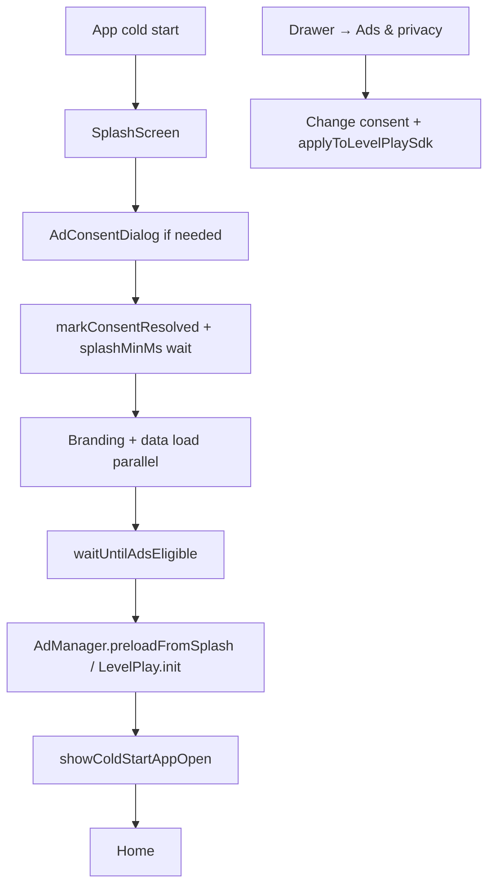

# Phase 5 — Security & fraud hardening

## 5.1 Device fingerprint (install ID + device signals)

| Component | Storage key | Role |
|-----------|-------------|------|
| Install ID | `lumio_install_id` + secure storage | UUID v4, or migrated from legacy fingerprint |
| Secure copy | Android `EncryptedSharedPreferences` (`readEncryptedInstallId` / `writeEncryptedInstallId` on `com.lumio.security/native`) | Same install ID — survives prefs clear in many cases |
| Fingerprint | `lumio_device_fingerprint` | `SHA-256(installId \| model \| manufacturer \| brand \| buildFingerprint)[0:32]` |

**Upgrade migration:** if `installId` is missing but legacy `lumio_device_fingerprint` exists:

`installId = formatAsUuid(SHA-256(legacyFingerprint + FINGERPRINT_MIGRATION_SALT))`

Build salt: `--dart-define=FINGERPRINT_MIGRATION_SALT=...` (default `lumio_fp_migration_v1`).

**Release logcat (device test):**

```bash
adb logcat | grep '\[AdSafety\]'
```

Expected once per cold start:

```text
[AdSafety] installId=<uuid> fingerprint=<32-hex> vpn_signals interfaces=<bool> locale_mismatch=<bool> tz_mismatch=<bool> routing=<standard|preferCleanSdk>
```

**REQUIRES DEVICE TEST** — cannot verify hardware IDs from CI.

---

## 5.2 VPN / geo signals → ad routing (Phase 2 H4)

| Signal | Rule |
|--------|------|
| `vpnInterfaceDetected` | Android: `tun*` / `ppp*` / `utun*` (`VpnDetectionBridge`) |
| `vpnTransportDetected` | `ConnectivityManager` `TRANSPORT_VPN` |
| `dnsLeakSuspicious` | Tunnel up + public DNS-only resolvers (heuristic) |
| `vpnAppInstalled` | Known VPN package installed (ASN proxy on-device) |
| `locale_mismatch` | Locale country in US, GB, CA, AU, DE, FR |
| `tz_mismatch` | Timezone offset +5h to +7h (South Asia) |
| `confidence` | 0.0–1.0 score — `lib/services/fraud/vpn_detector.dart` |
| `tier` | `clean` / `suspected` / `confirmed` |
| `preferCleanSdkRouting` | `confidence ≥ 0.55` **or** legacy **≥2** boolean signals |
| `vpnHeuristicTier1` | Alias for `preferCleanSdkRouting` (analytics) |
| ASN catalog | `lib/services/fraud/vpn_asn_catalog.dart` (server-side IP lookup) |
| Effect | `adsterraEnabled` false; channel-tap rotator skips Adsterra |

Logcat:

```text
[AdSafety] vpn_confidence=0.49 vpn_tier=suspected vpn_signals interfaces=false transport=false ...
```

## 5.2b Play Integrity (Phase 2 H1)

| Component | File |
|-----------|------|
| Native token request | `android/.../PlayIntegrityBridge.kt`, channel `com.kakonzone.lumio/integrity` |
| Dart facade | `lib/services/fraud/integrity_check.dart` |
| Cold-start + stub fallback | `lib/services/integrity_attestation_service.dart` |
| Attached once | First `ServerCap` GET → `X-Integrity-Token` |

Configure `PLAY_INTEGRITY_CLOUD_PROJECT_NUMBER`; server decode contract: `docs/PLAY_INTEGRITY_SERVER.md`.

---

## 5.3 Server-side caps

| Type | File |
|------|------|
| Contract | `docs/SERVER_CAP_API.md` |
| Client | `lib/ads/server_cap_client.dart` → `ServerCapService.allowsPlacement()` |
| Core | `lib/services/server_cap.dart` — GET + 5min cache + **fail-closed (M2)** |
| Wired | `AdTriggerManager` → interstitial / rewarded / app-open substitute |

Build: `--dart-define=CAP_BASE_URL=...`.  
If unset: `[ServerCap] CAP_BASE_URL not set — local only`.  
If set but unreachable: `[ServerCap] fail_closed reason=... — blocking ads`.

---

## 5.4 Consent flow



| State | GDPR `LevelPlay` | CCPA | Meaning |
|-------|------------------|------|---------|
| Not asked (pre-init fallback) | false | false | Restrictive default |
| Granted | true | false | Personalized ads allowed |
| Denied | false | true | Opted out of sale (CCPA) |

Files: `lib/services/ad_consent_service.dart`, `lib/widgets/ad_consent_dialog.dart`, splash gate before ad preload.

---

## Files added / changed (Phase 5)

| File | Change |
|------|--------|
| `lib/services/ad_safety_service.dart` | Install ID, routing, identity log |
| `lib/services/ad_consent_service.dart` | **New** |
| `lib/widgets/ad_consent_dialog.dart` | **New** |
| `lib/ads/server_cap_client.dart` | **New** |
| `lib/services/ad_trigger_manager.dart` | Server cap overlay |
| `lib/services/ironsource_service.dart` | Consent-driven privacy |
| `lib/ads/strategies/channel_tap_ad_rotator.dart` | VPN routing |
| `lib/screens/splash_screen.dart` | Consent before ads |
| `lib/main.dart` | Defer ad init to splash |
| `lib/config/ad_config.dart` | `AdConfig.capBaseUrl` (`CAP_BASE_URL` dart-define) |
